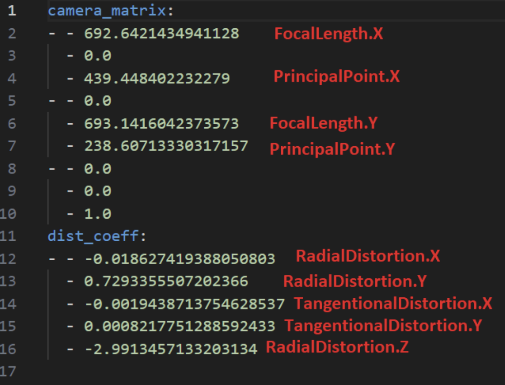
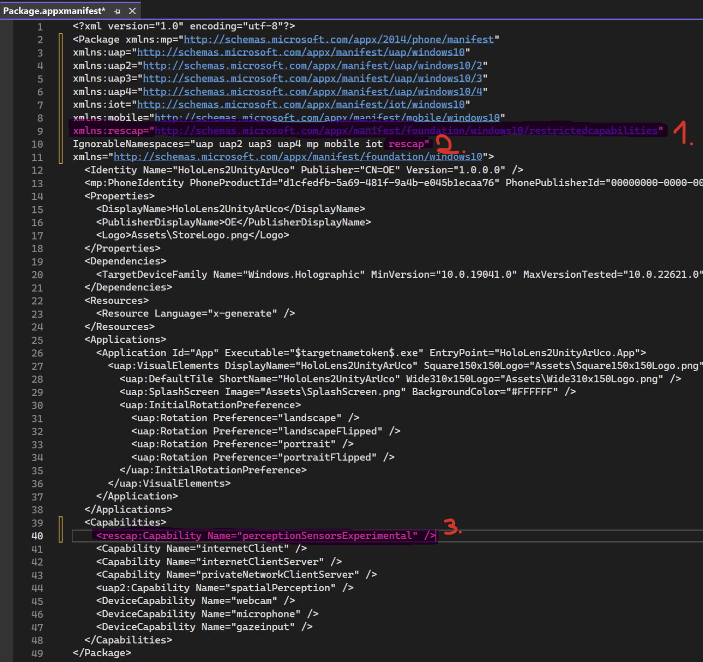
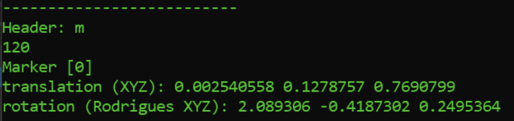

# HoloLens2CVExperiments
This repo contains the project files I used during my thesis work. It implements ArUco marker detection and pose estimation with OpenCV and Unity using the Microsoft HoloLens 2's Photo Video or Visible Light cameras.

## Table of contents

- [Prerequisites](#prerequisites)
- [Quick Start](#quick-start)
- [Usage](#usage)
  - [Generating aruco markers](#generating-aruco-markers)
  - [Calibrating the Photo Video camera](#calibrating-the-photo-video-camera)
  - [Calibrating the Visible Light cameras](#calibrating-the-visible-light-cameras)
  - [Receiving aruco marker data from the HoloLens 2](#receiving-aruco-marker-data-from-the-hololens-2)
- [Acknowledgement](#acknowledgement)

## Prerequisites
To test out this repo's full functionality, you'll need to have the following hardware and software ready:

- A PC running at least **Windows 10 19044.3448**
- A Microsoft HoloLens 2 device
- An Xbox Controller with **Bluetooth capability**
- Microsoft Visual Studio 2022 installed with **UWP Platform developent modules**
- Unity Hub with **Unity 2023.3.3f1** + **UWP Build Support** installed
- Python 3 with **opencv-python & opencv-python-contrib** installed

## Quick Start
1. Clone this repo:
```zsh
git clone https://github.com/nooway077/HoloLens2CVExperiments.git
```
2. Inside the `HoloLens2CVExperiments/aruco-pose-estimation/opencv` directory, you will find pregenerated aruco markers with A4 size. Print it out.
3. Measure at least one aruco marker's side on the print and take note of it.
4. Open up Unity Hub and load the **HoloLens2CVUnity** project from `HoloLens2CVExperiments/aruco-pose-estimation/projects/nonresearchmode` directory.
5. In the Unity Editor open the `ArUcoTracking` scene from the `Assets/Scenes` directory and click on the `ScriptConfiguration` object.
6. Enter the length of the marker's side you've measured earlier into the `Marker Size` field. **(The unit is in meters so convert it)**
7. In the Unity Editor open up the **Build Settings** and make sure the 
`ArUcoTracking` scene is ticked and the **Universal Windows Platform** is selected.
8. Click **Build** and select the output directory.
8. Once Unity is finished with the build process, inside the output directory open up the `HoloLens2CVUnity.sln` using **Visual Studio 2022**.
10. Select **ARM64** is selected as build platform and add `Visual C++ 2015-2019 UWP Desktop Runtime` as reference to **HoloLens2CVUnity (Universal Windows)** project. **Build & Deploy** to the Device using either the IP address or Local USB connection.
11. On the HoloLens 2, launch the **Start Menu** using the *"Start Gesture"* then search for **HoloLens2CVUnity** app and tap it to start.
12. Grant all access requests. When you move your gaze to the printed out paper containing the aruco markers, virtual cubes should be rendered on top of the markers.

## Usage
There are utility scripts included for generating aruco markers, calibrating the cameras and receiving data from the HoloLens 2. The following chapters will show you how to use these.

### Generating aruco markers
1. Open a terminal or command prompt and change working directory to `HoloLens2CVExperiments/aruco-pose-estimation/utilities`
2. Open up the `GenerateArUcoMarkers.py` file with your favorite text editor and configure the highlighted variables to your needs. 
**Predefined dictionaries** can be found here: https://docs.opencv.org/4.8.0/de/d67/group__objdetect__aruco.html
3. Run the script 
```zsh
python GenerateArUcoMarkers.py
```
4. The generated markers will be placed inside a newly created `output` directory. You can print them out individually or combine them using other software such as MS Paint.

### Calibrating the Photo Video camera
Note: *Step 8 & 9* are **only required once** if the build output folder containing the solution file is not deleted.
1. Inside the `HoloLens2CVExperiments/aruco-pose-estimation/opencv` directory you'll find a `pattern.png` file. Print that out, then measure one square's side and take note of it.
2. Open the **HoloLens2CVUnity** project from Unity Hub.
3. Inside the Unity Editor, head to the `Assets/Scenes` directory and open the `CameraCalibration` scene.
4. Click `ScriptConfiguration` object inside the **Scene Hierarchy** and on the right side under `TCP Client (Script)` enter the **IP address** of your PC on which the `TCPServer.py` will be running.
5. Save the scene and then open up the **Build Settings**
6. Untick `Scenes/ArUcoTracking` in **Scenes to Build** and tick `Scenes/CameraCalibration`.
7. Build the project, then in the output folder open the `HoloLens2CVUnity.sln` using Visual Studio 2022.
8. Right click on **HoloLens2CVUnity (Universal Windows)** project and **Add Reference**.
9. Select `Visual C++ 2015-2019 UWP Desktop Runtime`, then click **Apply**.
10. **Build & Deploy** the app to the HoloLens 2.
11. Start the `TCPServer.py` from `HoloLens2CVExperiments/aruco-pose-estimation/utilities` by running 
```zsh
python TCPServer.py
```
12. Connect the Xbox controller to the HoloLens 2 using Bluetooth and then start the **HoloLens2CVUnity** app.
13. Grant all requested access to the app, and then it will display a realtime preview from the PV camera on the device. Ensure the printed out `pattern.png` is on a **flat surface**. Start taking pictures of the paper from **different angles and distances** by moving around and pressing the **A Button** on the **Xbox Controller**.
The images will be saved on the PC running the `TCPServer.py` script to the `data/photovideo` directory.
14. Open the `Calibrate_PhotoVideo.py` file with your favourite text editor and change the `squareLength` variables value to the square's side length you have measured earlier.
15. Run the script
```zsh
python Calibrate_PhotoVideo.py
```
16. The computed calibration parameters are saved to `PhotoVideo_intrisics.yaml` file. Open this file with your favourite text editor input these values to the `ArUcoTracking` scene's `ScriptConfiguration/Custom Camera Intrinsics` field.



17. Switch back to the `Scenes/ArUcoTracking` scene in the **Build Settings**. (untick `Scenes/CameraCalibration` scene)
18. Build and Deploy again the **HoloLens2CVUnity** project.
19. Try the app with the new calibration parameters.

### Calibrating the Visible Light cameras
Note: *Step 8, 9, 10, 11, 12* are **only required once** if the build output folder containing the solution file is not deleted. 
1. Inside the `HoloLens2CVExperiments/aruco-pose-estimation/opencv` directory you'll find a `pattern.png` file. Print that out, then measure one square's side and take note of it.
2. Open Unity Hub and load the `HoloLens2CVResModeUnity` project from `HoloLens2CVExperiments/aruco-pose-estimation/projects/researchmode`.
3. Inside the Unity Editor, head to the `Assets/Scenes` directory and open the `CameraCalibration` scene.
4. Click `ScriptConfiguration` object inside the **Scene Hierarchy** and on the right side under `TCP Client (Script)` enter the **IP address** of your PC on which the `TCPServer.py` will be running.
5. Save the scene and then open up the **Build Settings**
6. Untick `Scenes/ArUcoTracking` in **Scenes to Build** and tick `Scenes/CameraCalibration`.
7. Build the project, then in the output folder open the `HoloLens2CVResModeUnity.sln` file using Visual Studio 2022.
8. Click on **HoloLens2CVResModeUnity (Universal Windows)** project, and find the `Package.appxmanifest` file. Right click and **Open With**.
9. Choose **XML Editor**, then click **OK**.
10. Add the following entries to the `Package.appxmanifest` file:
```
1. xmlns:rescap="http://schemas.microsoft.com/appx/manifest/foundation/windows10/restrictedcapabilities"
2. rescap
3. <rescap:Capability Name="perceptionSensorsExperimental" />
```


11. Right click on **HoloLens2CVResModeUnity (Universal Windows)** project and **Add Reference**.
12. Select `Visual C++ 2015-2019 UWP Desktop Runtime`, then click **Apply**.
13. **Build & Deploy** the app to the HoloLens 2.
14. Open a web browser and type your HoloLens 2's IP address to the address bar. Login with your **Device Portal Credentials**.
15. In the **Device Portal** navigate to **System > Research Mode** and tick **Allow Access to sensor streams** checkbox, then **REBOOT** your device.
16. Start the `TCPServer.py` from `HoloLens2CVExperiments/aruco-pose-estimation/utilities` by running 
```zsh
python TCPServer.py
```
17. Connect the **Xbox controller** to the HoloLens 2 using **Bluetooth**.
16. On the HoloLens 2 open the **Start Menu** and tap **HoloLens2CVResModeUnity**. Grant all requested access. The app will display a realtime preview from the VLC cameras **(Left front and Right front)**.
18. Move your gaze to the printed out pattern.png and take pictures of it **from different angles and distances** by moving around and pressing the **A Button** on the **Xbox controller**. Once enough pictures are saved, head back to the PC the `TCPServer.py` is running on.
19. Inside the `HoloLens2CVExperiments/aruco-pose-estimation/utilities` directory run the following commands:
```zsh
python Calibrate_LeftFront.py
python Calibrate_RightFront.py
```
20. The computed calibration parameters will be saved to `LeftFront_intrisics.yaml` & `RightFront_intrisics.yaml` files. Open these files with your favourite text editor and input the values to the `ArUcoTracking` scene's `ScriptConfiguration/Camera Intrinsics` field.
21. Switch back to the `Scenes/ArUcoTracking` scene in the **Build Settings**.
22. Build and Deploy again the **HoloLens2CVResModeUnity** project.
23. Try the app with the new calibration parameters.

### Receiving aruco marker data from the HoloLens 2
Note: This feature is not implemented in the **researchmode project**.
1. Open a terminal or command prompt and change working directory to `HoloLens2CVExperiments/aruco-pose-estimation/utilities`
2. Open up the `TCPServer.py` file with your favorite text editor and change the `serverHost` variable's value to the IP address of your NIC which is on the same subnet as the HoloLens 2.
3. Run the script
```zsh
python TCPServer.py
```
4. Open the **HoloLens2CVUnity** project from Unity Hub.
5. In the Unity Editor, open `Assets/ArUcoTracking` scene then click `ScriptConfiguration` object inside the **Scene Hierarchy**.
6. Inside the `ScriptConfiguration` there is a checkbox called `Send Detected ArUco Data Via TCP`, make sure that is checked.
7. Under `TCP Client (Script)` enter the **IP address** of your PC on which the `TCPServer.py` is running. **For this to work the PC and the HoloLens 2 should be on the same subnet.**
8. Build and Deploy the project as described in the **Quick Start** section.
9. Start the app on the HoloLens 2.
10. When you move your gaze to the printed out paper containing the aruco markers, virtual cubes should be rendered on top of the markers, and the `TCPServer.py` script should print out the rotation & translation vectors of the observed markers relative to the PV camera.



## Acknowledgement

D. Ungureanu, F. Bogo, S. Galliani, P. Sama, X. Duan, C. Meekhof, J. Stühmer, T.J. Cashman, B. Tekin, J.L. Schönberger, B. Tekin, P. Olszta, M. Pollefeys, HoloLens 2 Research Mode as a Tool for Computer Vision Research, ArXiv:2008.11239. (2020). https://arxiv.org/abs/2008.11239

M. Doughty, N.R. Ghugre, Head-Mounted Display-Based Augmented Reality for Image-Guided Media Delivery to the Heart: A Preliminary Investigation of Perceptual Accuracy, Journal of Imaging. 8 (2022). https://doi.org/10.3390/jimaging8020033

Wenhao. HoloLens2-ResearchMode-Unity.
https://github.com/petergu684/HoloLens2-ResearchMode-Unity